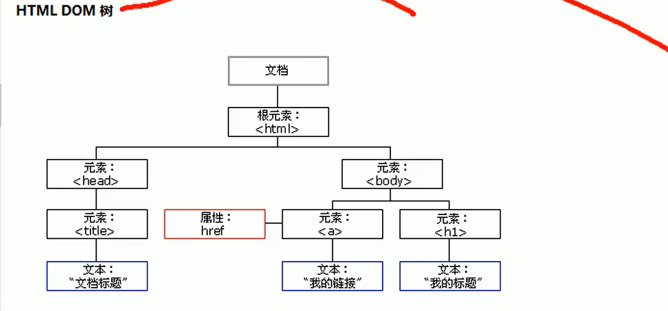
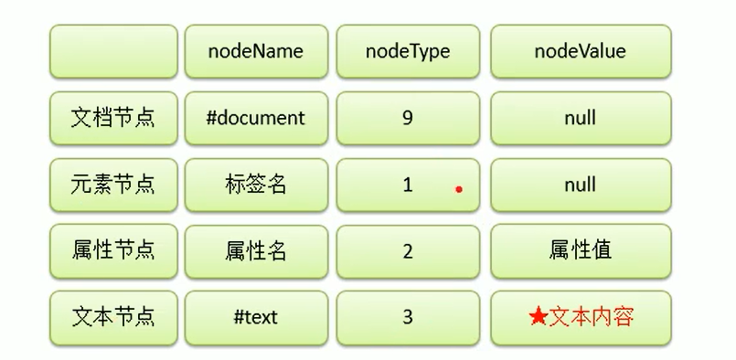

## JavaScript学习

### ECMAScript

### DOM

### BOM

### Document

- 一个Document相当于一个页面
  Document.write() 写如body

- JS代码按照顺序执行
  按照script  引入顺序执行

- 字面量和变量
  字面量是一些不可变的值
  变量可以保存字面量，可以任意改变
  使用var a； 来声明一个变量
- 标识符
  由我们自主命名
  可以由字母数字$_
  不可以是关键字
- 数据类型
  String Number Boolean Null Undeifined 基本类型
  Object 引用类型
- typeof 检查并返回类型
  

## HTML

w3c标准

### Html简介

#### html 结构

​	<!DOCTYPE html> 默认以html5去解析

​	head
​	body 

​	div会换行     p  span用于行内布局

​	script

#### 标签（行标签和块标签）

- p

​		`
	
`					

- 文本格式化标签
   <b
  <strong
  <i
  <em

  <pre预格式化文本
  <small
  <sub 上标
  <sup  下标

#### 块级元素和行内元素

- 块级元素：独占一行，可以设置宽度和高度，没有设置宽度没高度，默认铺满整行，
  块级元素可以包含块级元素和行级元素
  相当于display:block
- 行级元素：和相邻的行级元素占同一行，沾满之后自动换行，不能设置宽高，其内只能包含行级元素
  相当于 display: inline

#### W3C world wide web 

结构、表现、行为

- 统一标准
- 标签嵌套规则
  行级元素不可嵌套块级元素
  块级元素不可放在p忠
- 语义化标签
  p是段落标签
  ul有序
  ol无序
  option

#### 标签属性

- id 规定元素的唯一id
- class 规定元素的类名
- style 规定元素的行内样式
- title 规定元素的额外信息，当鼠标放在元素上的时候，提示文本内容

自定义标签属性：data-*

#### table属性

- border:表格边框
- width：表格宽度
- align：表格对齐方式left center right
- cellpadding:单元格文本与边框的距离
- cellspacing:单元格边框间距

完整表格:caption(标题) thead(表头) tbody(表体) tfoot（表尾）

#### form

- name:表单名称
- action:表单提交数据的地方
- method:

表单元素：

- input
- textarea
- select
- button

### Bom和Dom

- 获取body下的所有节点
  **var** o = document.getElementsByTagName("body") [0].childNodes;  //获取body下所有子元素
- 通过id查找HTML元素
  var element = document.getElementByid();
- 通过标签名查找HTML元素
  var x = document.getElementsByTagName("p");
- 通过类名查找HTML元素
  var element = document.getElementsByClassName("");
- 通过CSS选择器查找HTML元素（id、类名、类型、属性、属性值等等）
  var element = document.querySelectorAll()

- 通过HTML对象选择器查找HTML对象

  本例查找 id="frm1" 的 form 元素，在 forms 集合中，然后显示所有元素值：var x = document.forms[''];
  

### 对象

- 对象的分类
  内建对象
  宿主对象：由js运行环境提供的对象 如（BOM、Dom）
  自定义对象：开发人员自己创建
  
- 获取属性名
  var obj = new Object();
  obj.name = "孙悟空";
  获取 obj.name   obj["name"]
  
- 基本数据类型和引用数据类型
  基本：String Number Boolean Null  undefined
  
- 对象字面量
  var obj = {}; 
  
- 工厂方法创建对象
  function createObject(形参){

  var obj = new Object();

  ​	obj.

     return obj;
  }

- 构造函数

  构造函数执行流程:
  立刻创建新对象
  将新建的对象设置为函数中的this
  逐行执行函数中的代码
  将新建的对象作为返回值执行

  function Obj(){//首字母大写

  ​	this.name = "属性";//this就是新建的对象
  }
  var obj = new Obj();

  ​	a instanceof  b//判断a是b的实例

- 使用in可以检查属性中是否有某个属性   “属性”  in  obj == true
  hasOwnProperty()检查自身对象中是否包含某属性，不包括原型对象__proto__

- Date对象标识时间 
  var date = new Date();
  日期的格式 月份/日/年 时:分:秒
   getDate()获取当前日期对象时几日
  getDay()获取星期几
  getMonth()获取月份 +1

  getFullYear()获取年份
  time = Date.now()获取时间戳

- Math
  Math封装了数学相关的属性和方法
  Math.abs()返回数的绝对值
  Ma't'h.ceil()向上取整
  Math.floor()向下取整
  Math.round()四舍五入
  Math.random()随机生成
  Math.max() Math.min()

  Math.pow(x,y)返回x的y次幂
  

### 函数

- 介绍
  函数也是一个对象
  函数可以封装一个功能
  函数保存一些代码，在需要时执行

- 创建一个函数
  function 函数名 （形参1，形参2.。。。）{
  }
  var fun = function(形参){//匿名函数
  }；
  return 设置返回值    var result = sum(1,2);
  实参可以是任何值（基本类型、对象、函数)
  返回值也可以是任何值
  function fun(){}
  fun是函数对象·
  fun()调用函数

  （function(){//匿名函数或者叫做立即执行函数
  	}）()

- 枚举对象中的属性

  document
  使用for-in   语法：
  for(var 变量 in 对象){}
  
- prototype原型对象
  每个函数对象都有一个原型对象，
  如果函数作为普通函数调用，不起作用
  作为构造函数调用
  __proto__指向原型对象
  原型对象相当于一个共享区域，所有该对象都可访问
  对象的属性首先从该对象查找，如果没有去原型对象获取
  原型对象也有原型对象，直到找到object对象的原型

- 函数的方法
  call()和apply() 函数对象的方法

  a(){}   a.call()
  将执行的this
  fun.apply(obj)修改函数执行时的对象this
  fun.call(obj,a.b)后面作为实参传入
  fun.apply(obj,实参封装的参数)

- 调用函数时，浏览器每次会传两个隐含的参数
  函数的上下文对象this
  封装实参的对象arguments   
  arguemnt是一个类数组对象，和数组很像，调用函数时的实参，都会在arguments中，arguments中可以获取实参
  arguments[0]表示第一个实参，arguments.callee属性就是当前正在执行的函数

### 作用域

​    变量的作用范围

 	变量的声明提前：使用var 关键字，会在所有代码执行之前被声明
	函数的声明提前：function 函数名(){}会在所有代码执行之前声明，
			var fun2 = function(){}使用函数表达式不会声明提前，及在函数声明前调用会报错

- 全局作用域
  直接编写在script中的JS代码，页面打开时创建，页面关闭时销毁
  -全局作用贵有一个全局对象window，
  全乎作用域中，创建的对象都会做作为window对象的属性保存
  创建的函数作为window的方法保存
- 局部作用域
- 函数作用域
  调用函数是创建函数作用域，函数执行结束作用域销毁。每次调用创建一个作用域
  定义形参相当于在函数作用域中声明了变量
  如果函数中没有定义变量，使用的就是全局变量

### this

- 解析器在每次调用函数时都会向内部调用一个隐含的参数（有浏览器传入）

  this为函数执行的上下文对象
  根据函数的调用方式不同，this指向不同的对象

- 调用方式
  -函数方式调用  都为window
  fun(){
  }

  -方法方式调用 为调用对象

- 构造函数中this
  this就是构造函数创建的对象

### 数组（Array）

- dwa
  var arr = new Array();

  数组[索引] = 值

- 
  数组.length获取数组长度（非连续获取的时最大索引）

- 数组的4个方法
  push向末尾添加元素并返回数组长度
  pop删除数组的最后一个元素并返回删除元素

  unshift（）像数组开头添加一个元素并返回数组长度
  shift（）删除数组的第一个元素并将删除的元素作为返回值

- 数组的遍历
  for-i

  for-each   ie8以上可以使用
  arr.forEach(function(a,b){//第一个函数为正在遍历的元素。第一个元素是索引

  })

- 常用方法
  slice(start，end)从某个数组返回指定的元素 end取不到
  splice(start,end)删除指定区域元素   
  array.contract(）将两个数组连接成新数组，对原数组无影响
  join将原数组转化为一个字符串，作为结果返回，join（）中可以将元素作为连接符连接 array.join("-")
  reverse（）数组反转，影响原数组
  sort() 默认按照unicode编码排序，数字排序可能会得到错误的结果
  sort(function(a,b){

  ​	//大于0交换位置，小于不换位置
  })

  

### 包装类

- String()  Number() Object()
  基本数据类型去调用方法或属性时，浏览器临时转换为对象

- String对象方法
  charAt()获取指定位置所在字符
  charCodeAt()获取指定字符的字符编码
  fromCharCode（）可以根据字符编码获取字符

  indexOf() 检索字符串中是否含有莫字符，返回第一次出现的索引 没有找到返回-1
  lastIndexOf()从后往前找
  slice（start,end）截取字符串,不会影响源字符串

  如果省略都二个参数，截取后面所有
  subString(start,end)
  subStr(截取位置的索引，截取的长度)
  split()将字符串拆分为一个数组
  toUpperCase()

### 正则表达式

- 创建
  var reg = new RegExp("正则表达式","匹配模式");

  reg.test(str)判断str中是否包含某个字符

- 匹配模式
  i 忽略大小写

  g匹配全局模式

- 使用
  reg = a | b ;判断是否有a或b
  reg = [ab]   []里面的内容也是或关系   a-z为a到z   [A-z]所有 

  [a-z]所有小写字母
  [A-Z]所有大写字母
  [A-z]  所有字母
  a[bde]c
  [^ab    除了ab以外

- 字符串和正则相关的方法
  search()   搜索字符串中是否含有指定内容，返回索引，支持正则表达式，只会查找第一个
  match()  找到一个或多个正则表达式的匹配，返回符合条件的内容，默认返回第一个符合条件的内容，可以设置为全局模式，返回的结果是一个数组

  replace() 将字符串中指定内容替换为新内容

  参数：1.被替换的内容 2.新内容

  split()  

- 量词
  通过量词设置一个此出现的次数
  两次只对前面第一个词起作用

  var reg = /a{3}/;
  var reg = /a{1,3}/;出1~3次
  var reg = /a{3,}/出现3次以上
  n+至少一个 相当于{1，}
  n*包含零个或多个{0.}
  n? 包含零个或1个的字符串{0，1}
  var reg = /^a/;以a开头
  var reg = /a$/;以a结尾
  /^a$/以a开头，以a结尾

  检查手机的正则：以1开头  第二位3-9 第三位以后任意数字9个
  1^[3-9] [0-9]{9}$
  含有.
  .在正则表达式中表示任意字符
  var reg = / \ ./;使用\表达转义 
  \ \表示转义
  构造函数中，因为传入的是字符串，会进行转义，所以使用\反斜杠，需要用两个反斜杠

  - \w  任意字母、数字、下划线
    \W 除了字母、数字、下划线
    \d 任意数字
    \D 除了数字
    \s 空格
    \S 除了空格
    \b 单词边界
    \B 除了单词边界 var reg = /\bchild\b/; "hello child" true   "hello children" false

- 去除字符串前后空格
  str = str.replace(/\s/g,"");//去所有的

  str = str.replace(/^\s*/,"") ;//去开头的
  str = str.replace(/\s * {$},"");//去结尾的
  str = str.replace(/^\s * | \s*$/g,"");//去开头和结尾的

  电子邮件
  任意字母数字下划线 + @ + 任意字母

  ^\w{3,}(\ . \ w+)* @ [A-z0-9]+ (\ .[A-z]{2,5}){1,2} $
  ()选定 []或 {}量词

### Dom 文档对象模型

​	通过document来操作网页

- 文档、对象、模型
  

- Node
  网页的每一个元素都是节点
  常用节点类型：
  文档节点 整个html文档
  元素节点 html文档中的标签节点
  属性节点 元素的属性
  文本节点 html标签中的文本
  
  < button id = "btn">nihao <  /button >
  var btn= document.getElementById("btn");//获取btn元素
  btn.innerHtml = "hello"; //设置里面的内容

- 事件

  - 文档或浏览器发生交互的特定瞬间

  - js和html之间的交互是通过事件实现的

  - 比如 点击某个元素，将鼠标移到某个元素上方，按下键盘的某个键等

    - onclick = ""点击 
    -  onmousemove= 鼠标移动

  - 通过对象绑定事件

    var btn = document.getElementById("btn");

    btn.onclick = function(){//响应函数} //绑定一个单击击事件

    btn.ondbclick = function(){//响应函数}//绑定双击事件

  - 文档的加载

    - 浏览器加载页面的顺序，按照自上往下加载，读取一行运行一行

    - 将js在页面后面，确保加载完页面之后执行js
    - onload事件会在整个页面加载之后触发
      - 支持该事件的js对象 image、layer、window

  - 获取元素（标签）节点

    - getElementById() //通过id查询

    - getElementsByTagName()//通过tagname查询

    - getElemetnByName()//通过name查询

      innerHtml用于获取标签内部的html内容，

      自结束标配：Input标签没有内部，
      通过array [ index ].属性名     获取属性；读取class时要用className

  - 获取元素节点的子节点

    - 方法
      - getElementsByTagName()
    - 属性（节点是包含空白文本的）
      - childeNodes 表示当前节点的所有子节点
        - 获取包括文本节点在内的所有子节点，dom标签间的空白文本也为节点，ie8没有计算空白文本，其他浏览器是计算的
      - childern 获取当前元素的所有子元素（不包括空白文本）
      - firstElementChild获取当前元素的第一个子元素（不包含空白文本）ie8及以下不支持
      - firstChild获取当前元素的第一个子节点（包括空白文本） 
      - lastChild获取当前节点的最后一个节点
      - parentNode 当前的父亲节点
      - previousSibling 当前节点的前一个兄弟节点
      - nextSibling当前节点的后一个兄弟节点

  

