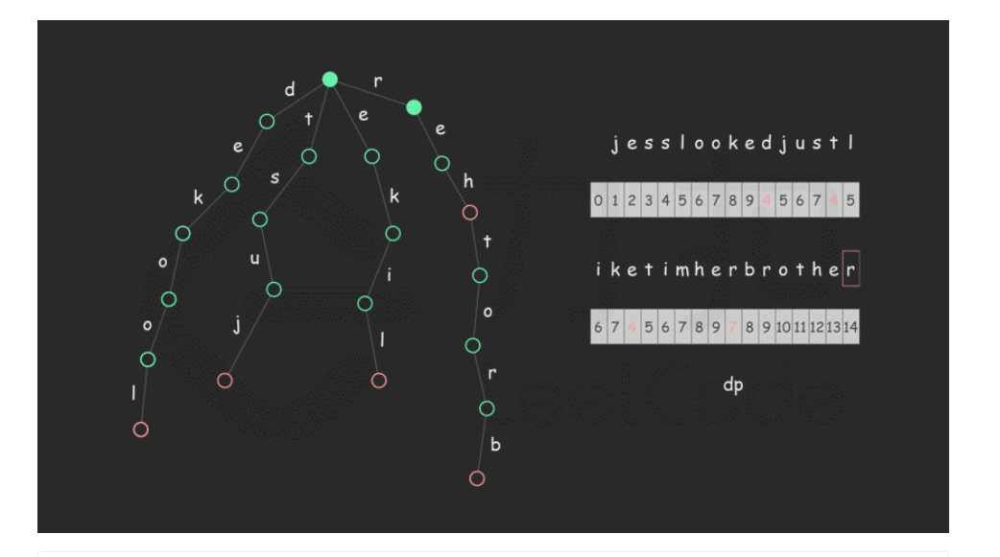

LeetCode 17.13. 恢复空格

构建字典树

+动态规划

动态转移方程

dp[i] = min(dp[i],dp[k-1]) //当能够完全匹配到字典时

dp[i] = dp[i]+1 //无法匹配

字典树-->n叉树


```java
class Tries{
    Tries[] next;
    boolean isEnd;
    public Tries(){
        this.next = new Tires[26];
        isEnd = false;
    }
    public void insert(String s){
      	Tries curent = this;
        int len = s.length();
        for(int i=len-1;len>=0;i--){
            int index = s.charAt(i) - 'a';
            if(current.next[index] == null){
            	current.next[index] = new Tries();
        }
            current = current.next(index);
        }
        current.end = ture;
 
} 
    
public void class test{
    public void back(Stirng[] dictory,String value){
        //生成字典树
        Tries tries = new Tries();
        for(int i = 0;i< dictory.length;i++){
            tries.insert(dictory[i]);
        }
        int strLen = value.length();
        int[] dp = new int[strLen + 1];
        dp[0] = 0;
        //动态规划求出最小返回值
        for(int i = 1;i<=strLen;i++){//第一次遍历字符串
            dp[i] = dp[i-1] +1;
            Tries current = tries;
            for(int j = i;j>=1;j--){//第二次遍历是从所选位置向左移动
                int index = s.charAt(j-1) - 'a';
                if(current.next[index] == null){
                    break;
                }
                if(current.next[index].isEnd == true){
                    dp[i] = Math.min(dp[i],dp[j-1]);
                }
                current = current.next(index);
            }
        }
        
    }
    
}
    
```

