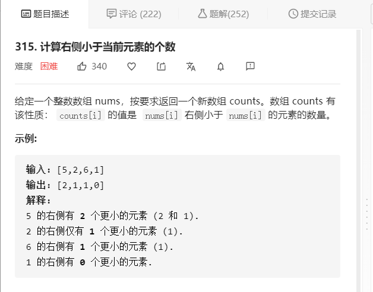

#### LeetCode315 计算右侧小于当前元素的个数



逆序数：如果一个排列中一对数的位置和大小刚好相反，那么他们就称为逆序

归并排序+索引数组


归并排序

```java
public void sort(int[] nums,int left,int right,int[] temp){
    if(left < right){
        int mid = (left + right) / 2;
       sort(nums,left,mid,temp);//左面排序
       sort(nums.mid + 1, right,temp);//右边排序
       merge(nums,left,right,mid,int temp);//合并  
    }
}

public void merge(int[] nums,int left,int right,int mid,int[] temp){
    int index = 0; //临时数组到那个位置
    int leftStart = left;
    int righrStart = mid +1;
    while(leftStart <= mid && rightStart <= right){
        if(nums[leftStart] < nums[rightStart]){
            temp[i++] = nums[leftStart++];
        }else {
            temp[i++] = nums[rightStart++];
        }
    }
    while(leftStart <= mid){//当右边数组全部放入，左边还有剩余
        temp[i++] = nums[leftStart++];
        
    }
    while(rihgtStart <= right){
        temp[i++] = nums[rightStart++]; 
    }
    i = 0;
    while(left <= right){//将nums数组中left到right的位置替换为排好序的temp
        nums[left++] = temp[t++];
    }
}
```


