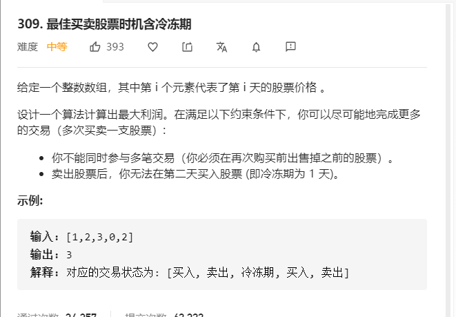

Leetcode 最佳买卖股票时机含冷冻期

20200710



分析过程

有关系的状态量：天数i、交易次数k、当天是否持有 0否,1是

穷举出所有可能出现的方式

​	`for  0<= i < =i  状态1`

​		`for 0<=k<=k  状态2`

 			`dp[i][k][....]`  状态n... 选择（买入、卖出、搁置）

在这先不考虑限制条件，比如只有买入才可以卖出，卖出后需要冷冻一天，这些先不考虑

​	`dp[i][k][0 or 1]` 这里表示第i天  交易次数k 持有或者不持有

通过分析

最终`dp[i][k][0]` 时有最大利润

因为只有在第n天不持有股票，才会有最大收益(这里不考虑交易次数)

`dp[i][k][0]` = (`dp[i-1][k][0]`,`dp[i-1][k][1]`)

`dp[i-1][k][0]` = (`dp[i-2][k][0]`,`dp[i-2][k][0]`)


`dp[i][0]` = max(`dp[i-2][0]`,`dp[i-2][1]`+price[i])

`dp[i][1]` = max(`dp[i-2][0]-process[i]`,`dp[i-2][0]`)


```java
class Solution {
    public int maxProfit(int[] prices) {
        int len = prices.length;
        int[][] nums = new int[len][2];
        if(len == 0){
            return 0;
        }
        for(int i = 0;i<len;i++){
            if(i == 0){
              nums[i][0] = 0;
              nums[i][1] = -prices[i]; 
              continue; 
            }
            if(i==1){
             nums[i][0] = Math.max(nums[i-1][0],nums[i-1][1]+prices[i]);
              nums[i][1] =  Math.max(nums[i-1][1], - prices[i]);  
              continue;
            }
            nums[i][0] = Math.max(nums[i-1][0],nums[i-1][1]+prices[i]);
            nums[i][1] =  Math.max(nums[i-1][1],nums[i-2][0] - prices[i]);
            
           
        }
       return nums[len-1][0];

    }

}
```

