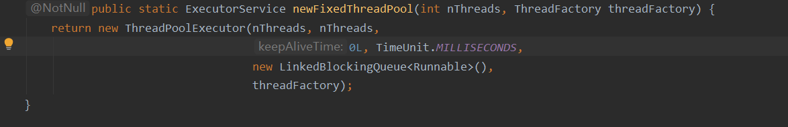
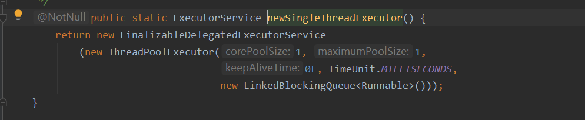
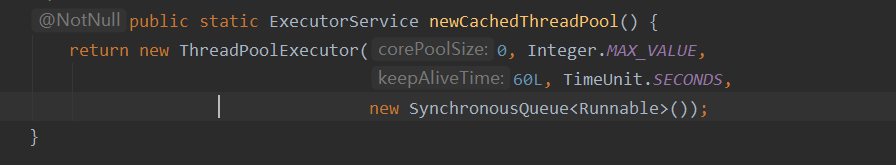
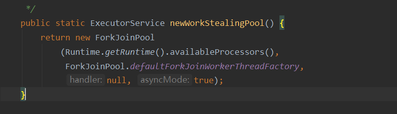
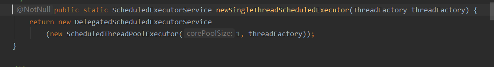
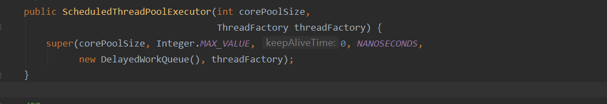

## 合理配置线程池

### 线程

根据任务性质划分

计算密集型 加密、正则

io密集型  网络传输、文件读取、数据库连接

### 队列

应该选用有界队列，防止内存溢出OOM

### 预定义的线程池

- FixedThreadPool
  创建固定数量的线程池，使用的无界队列

  

- SingleThreadPoolExecutor
  创建单个线程，需要顺序保证执行顺序，使用的无界队列

  

- CachedThreadPool
  根据需要创建新线程，执行短期异步执行任务，使用SynchronousQueue

  
  

- WorkStealingPool(jdk1.7以后)

  工作密取
  基于forkjoin实现

  

- ScheduleThreadPoolExecutor
  newSingleThreadSheduledExecutor()

- newScheduledThreadPool()
  

- 两个重要的方法
  scheduleAtFixedRate(Runnable command,long initialDelay,long period,TimeUnit unit)以恒定速率执行
  scheduleWithFixedRate(Runnable command,long initialDelay,long delay,TimeUnit unit)延迟执行