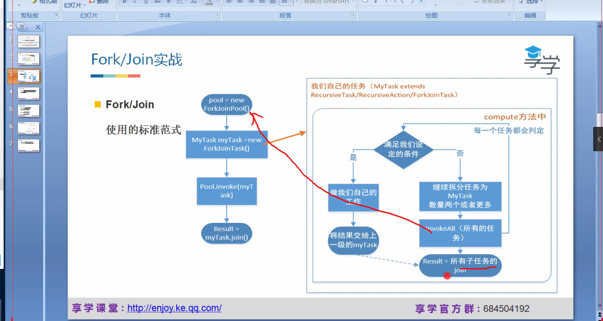

### 线程的并发工具类

#### join()方法

会释放锁

#### yield()

让出cpu但是不释放锁

#### sleep（）

让出cpu，不释放锁

#### wait（）

调用wait方法之前必须持有锁，调用该方法会释放锁，wait（）方法返回时会重新持有锁

#### notify（）

调用该方法也必须持有锁，写在同步代码块中，写在最后，调用notify（）方法本事不会释放锁

#### 并发工具类

Fork/Join

分而治之：将大问题分解为多个互斥的小任务，将子任务执行结果合并
工作密取

使用

RecursiveTask

#### ForkJoin的使用

1. 创建类Demo 并继承RecursiveTask

2. 在compute（）方法中写逻辑
   其中invokeAll（），Demo类相当于是任务。
   List< Demo tasks = new ArrayList< Demo >;
   invokeAll(tasks);

   //将结果合并
   for(Demo task :invokeAll(tasks){

   ​	task.join();

   }

3.main方法调用

​	ForkJoinPool pool = new ForkJoinPool();
​	Demo task = new Demo;
​	pool.execute(task);或者是pool.invoke(task);

需要注意的是异步执行的话，主线程可能很快结束，需要task.join();等待task执行完才让主线程结束

pool.invoke()同步
pool.execute()异步调用

#### 工具类

##### CountDownLatch

​	CountDownLatch countDownLatch = new CountDownLatch(n);

​	countDownLatch.await();

​	countDownLatch.countDown();

##### CyclicBarrier

​	设置数量，线程数量达到阈值，一起执行

##### Semaphore

##### Exchanger

​	仅限两个线程交换数据

##### Callable、Future、FutureTask

